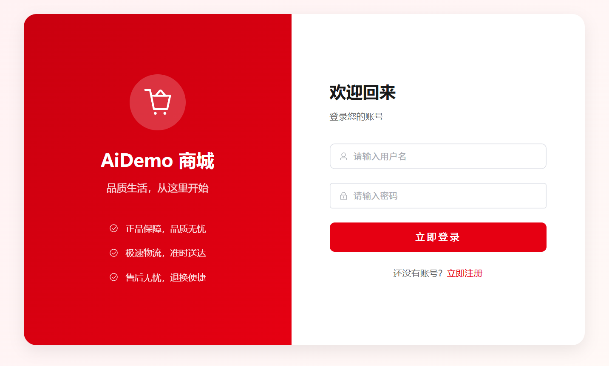
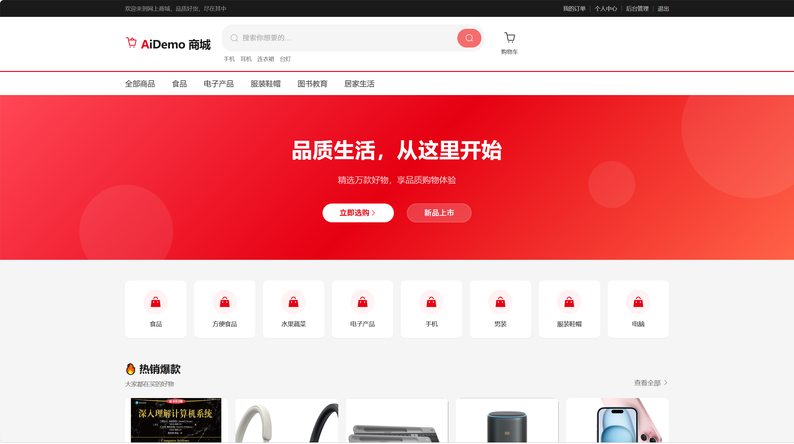
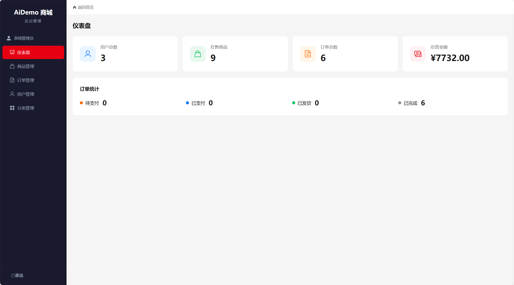

# 网上商城系统 — Online Shop

软件工程本科课程设计项目，基于 Spring Boot + Vue 3 的前后端分离电商系统。

## 项目截图

<details open>
<summary><b>🖼️ 点击查看项目实际效果图</b></summary>

### 1. 登录界面


### 2. 主界面


### 3. 后台管理首页


</details>

## 技术栈

| 层级 | 技术 | 版本 |
|---|---|---|
| 后端框架 | Spring Boot | 3.2.5 |
| 持久层 | MyBatis-Plus | 3.5.6 |
| 数据库 | MySQL | 8.x |
| 认证 | JWT (jjwt) | 0.12.5 |
| 前端框架 | Vue 3 + TypeScript | — |
| 构建工具 | Vite | 5.x |
| UI 组件库 | Element Plus | — |
| 状态管理 | Pinia | — |
| HTTP 客户端 | Axios | — |

## 功能模块

- **用户模块** — 注册、登录、JWT 认证、个人中心、修改密码
- **商品模块** — 商品列表（分页/分类筛选/排序）、搜索、详情、热销排行
- **购物车** — 加购、数量修改、选中/全选、实时价格计算
- **订单模块** — 下单（商品快照）、模拟支付、取消、确认收货、订单状态流转
- **后台管理** — 仪表盘统计、商品 CRUD、订单发货/送达、用户管理、分类管理

## 快速开始

### 环境要求

- JDK 17+
- Maven 3.8+
- MySQL 8.0+
- Node.js 18+

### 1. 初始化数据库

```sql
CREATE DATABASE IF NOT EXISTS shop_db DEFAULT CHARSET utf8mb4;
```

然后执行 `backend/src/main/resources/db/init.sql` 建表并导入种子数据。

### 2. 配置数据库连接

修改 `backend/src/main/resources/application.yml`：

```yaml
spring:
  datasource:
    username: root
    password: 你的密码
```

### 3. 启动后端

```bash
cd backend
mvn spring-boot:run
```

后端运行在 http://localhost:8080

### 4. 启动前端

```bash
cd frontend
npm install
npm run dev
```

前端运行在 http://localhost:5173

### 5. 上传商品图片

种子数据的商品暂无图片。用 `admin` 账号登录后，进入 **后台管理 → 商品管理**，编辑各商品上传图片。图片存储在 `backend/uploads/` 目录。

### 测试账号

| 角色 | 用户名 | 密码 |
|---|---|---|
| 管理员 | admin | admin123 |
| 普通用户 | user1 | admin123 |

## 项目结构

```
AiDemo/
├── backend/                        # Spring Boot + Maven
│   ├── pom.xml
│   └── src/main/java/com/demo/shop/
│       ├── ShopApplication.java
│       ├── common/                 # Result, PageResult, GlobalExceptionHandler
│       ├── config/                 # WebConfig, MyBatisPlusConfig, MetaObjectHandler
│       ├── security/               # JwtUtil, AuthInterceptor, AdminInterceptor, UserContext
│       ├── entity/                 # User, Category, Product, CartItem, Order, OrderItem
│       ├── dto/                    # LoginRequest, RegisterRequest, OrderCreateRequest...
│       ├── vo/                     # UserVO, ProductVO, OrderVO, CategoryVO...
│       ├── mapper/                 # MyBatis-Plus BaseMapper 接口
│       ├── service/                # 业务逻辑层（接口 + 实现）
│       └── controller/            # REST 控制器（含 admin/ 子包）
│
├── frontend/                       # Vue 3 + Vite + TypeScript
│   └── src/
│       ├── api/                    # Axios 封装 + 7 个 API 模块
│       ├── router/                 # Vue Router + 导航守卫
│       ├── stores/                 # Pinia (user, cart)
│       ├── views/                  # 页面组件（auth/home/product/cart/order/user/admin）
│       ├── components/             # 可复用组件
│       ├── types/                  # TypeScript 接口定义
│       └── utils/                  # 工具函数
│
└── docs/                           # 项目文档
    ├── 01-需求分析文档.md
    ├── 02-系统设计文档.md
    └── 03-API接口文档.md
```

## 设计决策

1. **认证方案** — 轻量 HandlerInterceptor + JWT，不使用 Spring Security，降低学习曲线
2. **库存防超卖** — `UPDATE ... WHERE stock >= ?` 乐观锁方式，检查 affectedRows
3. **图片上传** — 本地磁盘存储 + Spring 资源映射，文件用 UUID 命名防冲突
4. **下单快照** — 订单项存储下单时的商品名称、图片、价格，订单不受后续商品变更影响
5. **前后端开发代理** — Vite proxy 转发 `/api` 到后端，消除跨域问题

## 许可证

本项目仅用于学习目的。
